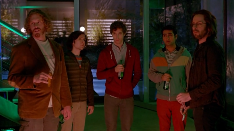

# 1. Minimum Viable Product <!-- omit in toc -->

- [Contexto](#contexto)
- [¿Aceptas el dinero o conservas la empresa?](#aceptas-el-dinero-o-conservas-la-empresa)
- [No es una empresa IT: es una secta](#no-es-una-empresa-it-es-una-secta)
- [¿Existe la puntuación Weissman?](#existe-la-puntuación-weissman)

## Contexto

El capítulo comienza en medio de una gran fiesta en Palo Alto, aunque parece que todos tienen los pies atornillados al suelo, porque ni se mueven ni parecen disfrutar. Qué digo, algunos no parecen estar vivos. 

Aquí conocemos al equipo de tarados que veremos durante toda la serie, o no. En realidad no son tarados, a excepción de Erlick, pero de momento son unos insectos comparados con los tiburones que tienen alrededor.

> De izquierda a derecha: Erlick Bachman, Cabezón, Richard Hendricks, Dinesh y Gilfoyle.

Esta fiesta es para celebrar un trato multimillonario entre Google y el equipo que está festejando: les compraron la empresa por más de 200 millones de dólares. Esta escena introductoria ya nos da pistas de lo que viene más adelante.

## ¿Aceptas el dinero o conservas la empresa?

Si logras crear algo que tiene el potencial de cambiar el mundo, ¿cierras el mejor trato de tu vida aceptando la mejor oferta y dejas que otro se lleve la gloria o asumes el reto y tomas las riendas hacia un nuevo mañana? Este es el difícil dilema que toca este capítulo.

Richard seguramente se enfrenta aquí a la decisión más difícil de su vida. El dueño de Hooli, Gavin Belson, se entera de que Richard, uno de sus empleados, ha creado un algoritmo capaz de hacer busquedas en un espacio de compresión.

## No es una empresa IT: es una secta

¿Qué tiene de malo Hooli?

## ¿Existe la puntuación Weissman?

https://en.wikipedia.org/wiki/Weissman_score

https://www.quora.com/Is-the-Weissman-Score-a-real-metric-as-shown-in-Silicon-Valley-What-does-the-score-represent#:~:text=The%20Weissman%20Score%20is%20a%20fictional%20rating%20system%20of%20the,rate%20for%20the%20compression%20system.